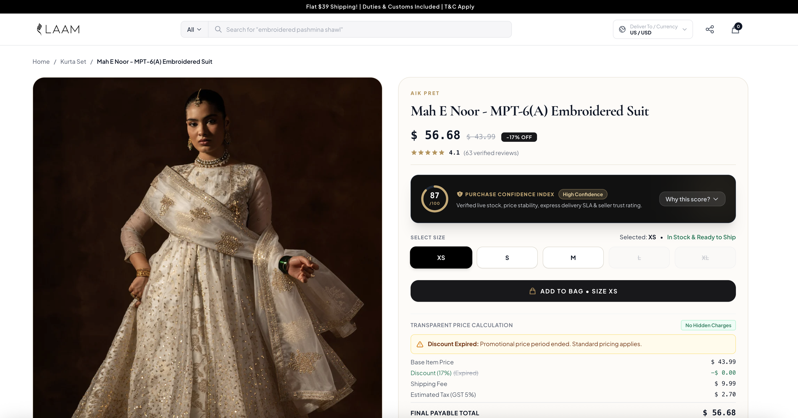

# LAAM — Purchase Confidence Center

A full-stack solution built for the **LAAM Software Engineer Assessment**. The project addresses customer hesitation in online fashion marketplaces by consolidating scattered signals — size availability, transparent pricing, delivery reliability, seller trust, and smart alternatives — into an explainable **Purchase Confidence Score (0–100)**.

> 📦 **GitHub Repository:** [https://github.com/MQ-06/laam-purchase-confidence-center](https://github.com/MQ-06/laam-purchase-confidence-center)

---

## Application Screenshots

| Catalog & Browse View | Product Detail & Confidence Center |
|:---:|:---:|
|  |  |

| Mathematical Factor Breakdown Expanded |
|:---:|
|  |

---

## Table of Contents

1. [Problem Understanding](#1-problem-understanding)
2. [Scope](#2-scope)
3. [User Flow](#3-user-flow)
4. [Technical Approach](#4-technical-approach)
5. [How to Run Locally](#5-how-to-run-locally)
6. [Testing](#6-testing)
7. [Tradeoffs Made](#7-tradeoffs-made)
8. [Future Improvements](#8-future-improvements)
9. [AI Usage & Audit Trail](#9-ai-usage--audit-trail)

---

## 1. Problem Understanding

On marketplaces like LAAM, customers browse visually similar fashion products across multiple independent brands, sizes, price ranges, and delivery SLA windows. Before making a buying decision, customers ask five critical questions:

1. *Is this product available for me?*
2. *Is my preferred size in stock?*
3. *What will I actually pay (no hidden fees)?*
4. *Can I trust the delivery promise?*
5. *Are there better in-stock alternatives if this item is unavailable?*

Previously, these signals were scattered across the product detail page without interpretation. The **Purchase Confidence Center** solves this by consolidating all signals into a single, transparent panel powered by a deterministic, explainable Confidence Score algorithm.

---

## 2. Scope

### In-Scope (Delivered)

- **Product Browse Catalog (`/`)**: Minimal, responsive product grid displaying price, category, discount tags, and direct links to the Confidence Center.
- **Product Detail & Confidence Center (`/product/:id`)**:
  - Live per-size stock status (`in_stock`, `low_stock`, `out_of_stock`).
  - Interactive size selector with real-time API state updates.
  - Transparent price calculator itemizing base price, discount, shipping, GST tax (5%), and final payable total.
  - Delivery SLA confidence breakdown (estimated days, dispatch window, carrier SLA reliability %).
  - Seller trust signals (star rating, total review count, verified partner badge, 7-day return eligibility).
  - Composite Confidence Score (0–100) with animated radial gauge and expandable "Why this score?" factor table.
  - Smart alternatives engine: automatically triggers 2–3 recommended in-stock items when a size is out of stock.
- **Backend API & Service Layer (`/server`)**:
  - Express app with clean 3-tier architecture (Routes → Services → In-Memory Data Store).
  - Single composed endpoint `GET /products/:id/confidence?size=X` avoiding frontend request waterfalls.
  - Comprehensive unit test suite with 45 tests using Vitest.

### Intentionally Deferred (Out-of-Scope)

- Full cart persistence, checkout, or real payment gateway integrations.
- User authentication and buyer account management.
- Live courier SLA API integrations (mocked via realistic seller performance metrics).
- Seller administration dashboard.

---

## 3. User Flow

```
[ Catalog Browse View ]
        │
        ▼ (Click Product Card)
[ Product Detail Page ] ───► Single GET /products/:id/confidence request
        │
        ├──► Customer sees initial Confidence Score (e.g. 98 - High Confidence)
        │
        ├──► Customer selects a size (e.g. "M")
        │       │
        │       ├── [In Stock / Low Stock]:
        │       │     • Real-time update of stock badge ("12 in stock")
        │       │     • Price calculation & delivery window updated
        │       │     • "Add to Bag" button ENABLED
        │       │
        │       └── [Out of Stock]:
        │             • "Add to Bag" button DISABLED with warning
        │             • "Recommended In-Stock Alternatives" strip automatically appears
        │             • Displays 2-3 matched items (same category/brand, similar price, in-stock)
        │
        └──► Customer expands "Why this score?" to inspect exact mathematical factor breakdown.
```

---

## 4. Technical Approach

### Architecture & Tech Stack

| Layer | Technology | Rationale |
|:---|:---|:---|
| **Frontend** | React 19 + TypeScript + Vite | Typed contracts with backend, fast HMR dev loop. |
| **Styling** | Tailwind CSS v4 + Vanilla CSS | Custom South Asian luxury design tokens, responsive layout, CSS micro-animations. |
| **Routing** | React Router v7 | Client-side page navigation (`/` and `/product/:id`). |
| **Backend** | Node.js + Express + TypeScript | Lightweight service layer, zero framework bloat. |
| **Data Access** | In-Memory Map Store (`dataStore.ts`) | Eagerly loaded O(1) reads from JSON seed files. |
| **Testing** | Vitest | Fast, native ESM unit and API testing runner. |

### Project Structure

```
server/
  src/
    routes/          # Express route handlers
    services/         # confidenceService, pricingService, deliveryService,
                       # availabilityService, recommendationService
    data/              # JSON seed files (products, inventory, sellers)
  tests/               # Vitest unit + API integration tests

client/
  src/
    pages/             # Catalog.tsx, ProductDetail.tsx
    components/
      ConfidencePanel/  # ConfidenceScore, SizeSelector, PriceBreakdown,
                         # DeliveryConfidence, SellerTrustBadge, AlternativesList
    hooks/               # useProductConfidence.ts
    api/                 # client.ts
    types/               # shared TS types
```

### API Endpoints

| Method | Route | Description |
|---|---|---|
| `GET` | `/products` | Minimal catalog list for the browse view (id, title, brand, image, price, discount). |
| `GET` | `/products/:id/confidence?size=X` | Composed response: product, size/stock, pricing, delivery, confidence score, alternatives (if applicable). `size` is optional — defaults to the first in-stock size if omitted. |

**Error handling:**

| Case | Status | Behavior |
|---|---|---|
| Product not found | `404` | `{ error: "PRODUCT_NOT_FOUND" }` |
| Invalid size requested | `400` | `{ error: "INVALID_SIZE", validSizes: [...] }` |
| Server/data error | `500` | Generic error, logged server-side, no internals leaked |

### Data Model & Key Types

```ts
// Product Entity
interface Product {
  id: string;
  title: string;
  brandId: string;
  category: 'Kurta Set' | 'Lehenga' | 'Saree' | 'Anarkali' | 'Sharara Set';
  basePrice: number;
  discountPercent: number;
  discountExpiresAt: string | null; // ISO date or null
  images: string[];
  attributes: Record<string, string>;
  returnEligible: boolean;
}

// Inventory Row
interface InventoryRow {
  id: string;
  productId: string;
  size: 'XS' | 'S' | 'M' | 'L' | 'XL' | 'XXL';
  stock: number;
  warehouse: string;
  lastUpdated: string;
}

// Seller / Brand Entity
interface Seller {
  id: string;
  name: string;
  rating: number; // 0-5
  reviewCount: number;
  onTimeDeliveryRate: number; // 0-100%
  verified: boolean;
}
```

### Confidence Scoring Logic

The confidence engine calculates a weighted score (0–100) using 4 deterministic signals:

```
Confidence Score = (Stock × 0.35) + (Delivery × 0.30) + (Seller × 0.20) + (Price × 0.15)
```

- **Stock Weight (35%)**: `in_stock` = 100pts, `low_stock` (≤3) = 60pts, `out_of_stock` = 0pts.
- **Delivery Weight (30%)**: Direct percentage passthrough of seller's on-time delivery rate.
- **Seller Weight (20%)**: `(rating / 5) * 100`.
- **Price Weight (15%)**: `stable` (discount active) = 100pts, `unstable` (discount expired) = 50pts.

**Confidence Bands:**

- **85–100**: *High Confidence* (Emerald)
- **60–84**: *Good* (Amber)
- **< 60**: *Limited Confidence* (Red)

### Key Assumptions

- Single mocked region/currency (PKR); no multi-region pricing or delivery logic.
- GST fixed at 5% for all products, applied to (discounted price + shipping), not the raw base price.
- "Low stock" threshold fixed at ≤ 3 units, defined as a named constant (`LOW_STOCK_THRESHOLD`).
- Seller on-time delivery rate and review counts are seeded, not derived from real order/review history.
- No authentication — the app assumes a single anonymous customer session.

---

## 5. How to Run Locally

### Prerequisites

- **Node.js**: v18.0.0 or higher
- **npm**: v9.0.0 or higher

### Step 1: Clone & Install

```bash
git clone <repository-url>
cd LAAM

# Install backend dependencies
cd server
npm install

# Install frontend dependencies
cd ../client
npm install
```

### Step 2: Run Development Servers

In terminal window 1 (Backend API):

```bash
cd server
npm run dev
# Server starts at http://localhost:3001
```

In terminal window 2 (Frontend Client):

```bash
cd client
npm run dev
# Client starts at http://localhost:5173
```

Open your browser to `http://localhost:5173`.

---

## 6. Testing

The backend includes comprehensive unit tests for all domain services and end-to-end API integration tests.

### Running Tests

```bash
cd server
npm test
```

### Test Suite Summary (45 Tests — All Passing ✅)

- **`confidenceService.test.ts` (21 tests)**: Validates factor score conversions, weighting math, boundary conditions (85/60 limits), perfect/worst score scenarios.
- **`pricingService.test.ts` (9 tests)**: Validates discount subtractions, GST tax calculations, expired discount fallbacks, and floating-point rounding precision.
- **`availabilityService.test.ts` (6 tests)**: Validates stock status mappings against the `LOW_STOCK_THRESHOLD` (3 units).
- **`api.test.ts` (9 tests)**: End-to-end integration tests for `GET /products`, `GET /products/:id/confidence` (happy path, 404 missing product, 400 invalid size, out-of-stock alternatives trigger, and auto-size default).

### Not Covered (and what I'd test next)

- **Frontend component tests** (React Testing Library) for `SizeSelector` and `AlternativesList` — deferred due to time; these are the highest-value next additions since they cover user-facing state transitions, not just pure functions.
- **Concurrency/staleness**: no test currently simulates stock changing between page load and Add to Bag — noted as a known gap in Tradeoffs below.

---

## 7. Tradeoffs Made

1. **JSON Storage vs. SQLite/PostgreSQL**: Used in-memory Maps initialized from JSON seed files to eliminate database setup friction during a 3–4 hour evaluation window. The service abstraction ensures easy swap to an ORM/database in production.
2. **Single Composed Endpoint (`/confidence`)**: Combined stock, pricing, seller, delivery, and alternatives into a single API response. This trades network flexibility for zero frontend waterfalls and guaranteed temporal data consistency.
3. **Deterministic Weighting Matrix**: Used fixed, documented scoring weights rather than an ML/conversion-optimized algorithm. This prioritizes explainability ("Why this score?") over predictive opacity.
4. **No stock re-validation on Add to Bag**: Since there's no real cart/checkout, stock isn't re-checked at the point of action — documented here as a known gap rather than silently ignored.

---

## 8. Future Improvements

1. **Real-time Inventory Subscriptions**: Integrate WebSockets/SSE to push live inventory updates when stock changes while a customer is viewing a page.
2. **Review & True-to-Size Machine Learning**: Incorporate customer fit review data (e.g., "Runs 1 size small") directly into the confidence score calculations.
3. **Multi-Region Carrier API Integrations**: Connect directly to courier SLAs (e.g., DHL/FedEx) based on buyer pincode/zip code for pinpoint delivery estimates.
4. **Frontend component test coverage**: Add React Testing Library coverage for interactive state transitions (size selection, out-of-stock handling).
5. **Persistent storage**: Migrate from in-memory Maps to SQLite/PostgreSQL for real durability across restarts.

---

## 9. AI Usage & Audit Trail

AI tools were utilized throughout the project lifecycle for architectural planning, seed data drafting, component construction, and test suite generation.

### Summary of Manual Interventions & Corrections

- **Tax Calculation Fix** — see detailed example below.
- **Default Size Selection**: Implemented fallback logic in the controller to automatically select the first available `in_stock` size when no `?size=` parameter is provided.
- **Score Factor Breakdown**: Added `maxContribution` fields to factor objects so the UI can render exact mathematical progress bars.

### Example: Corrected AI Output

**Prompt given to AI:** "Add GST calculation to the pricing service."

**AI-generated output (incorrect):**

```ts
const tax = basePrice * 0.05; // taxed the pre-discount price
```

**Issue found:** This calculated tax on the *original* base price, not what the customer actually pays. For a discounted item, this over-taxed the customer relative to their real total — the tax should apply to the amount actually being charged (discounted price + shipping), not the sticker price.

**Corrected version:**

```ts
const discountedPrice = basePrice - (basePrice * discountPercent / 100);
const taxableAmount = discountedPrice + shippingCost;
const tax = taxableAmount * 0.05;
```

**How it was caught:** During manual review while writing `pricingService.test.ts` — the expected total in a discount test case didn't match the itemized breakdown, which surfaced the bug before it shipped.
